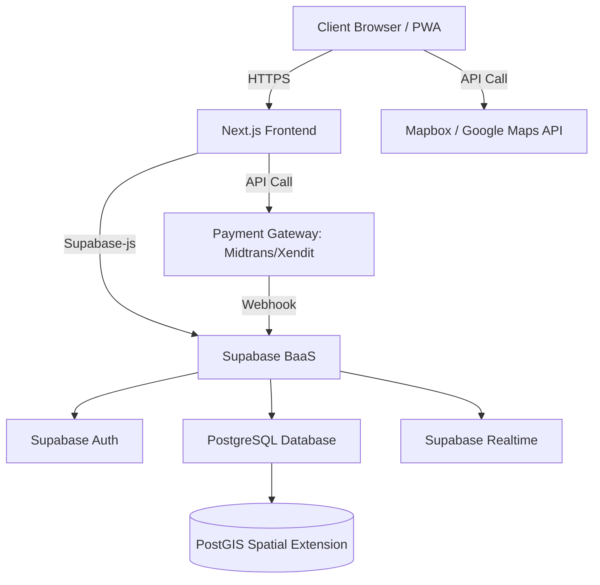

# 02. Architecture Document

## 1. High-Level Architecture
IsyaratHUB menggunakan arsitektur modern *serverless* dan PWA (Progressive Web App) yang dioptimalkan untuk performa dan interaktivitas waktu nyata, serta terintegrasi dengan sistem pembayaran.

## 2. Tech Stack Utama
*   **Frontend:** Next.js (App Router), PWA Enabled.
*   **Styling:** Tailwind CSS.
*   **State Management:** Zustand.
*   **Backend / Database:** Supabase (PostgreSQL).
*   **Logika Spasial:** PostGIS (Ekstensi PostgreSQL) untuk pencarian radius JBI.
*   **Peta & Geolokasi:** Leaflet / Mapbox / Google Maps API.
*   **Payment System (Baru):** Midtrans atau Xendit sebagai *Payment Gateway* untuk memproses pembayaran dan *payout/disbursement* (penarikan dana) ke rekening JBI.

## 3. Pola Arsitektur Bisnis & Keberlanjutan
*   **Hosting:** Aplikasi di-*deploy* di Vercel (Frontend) dengan domain `isyarathub.id`.
*   **Sistem Dompet (Wallet):** Saldo JBI disimpan di dalam *database* dan diatur menggunakan transaksi yang aman (ACID compliance di PostgreSQL) sebelum ditarik melalui *Payment Gateway API*.
